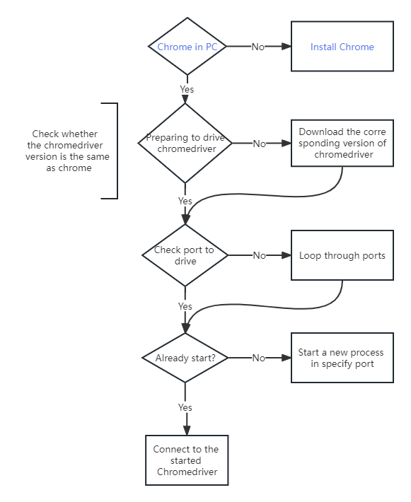

<h1 align="center">
  
   Getusee
</h1>

<h4 align="center">Fast web crawler development tool based on selenium + Chrome.</h4>

  
  

## Introduction

This project is to quickly develop some automated web page tests and small tools such as automated web page data
acquisition based on the selenium package (data acquisition is not as efficient as the direct request package). But 'Life
is short, use python', it can save you the time of matching software such as chrome driver, and you can use it
directly.

## Start process
*The process in blue font still needs to be implemented manually

  

## Template
TOFIX

### Related github repository

- [selenium](https://selenium-python-zh.readthedocs.io/en/latest/installation.html)

### Songs🎶

[Undertale --undertale](https://www.youtube.com/watch?v=8CeYNJ-s0Kw)
