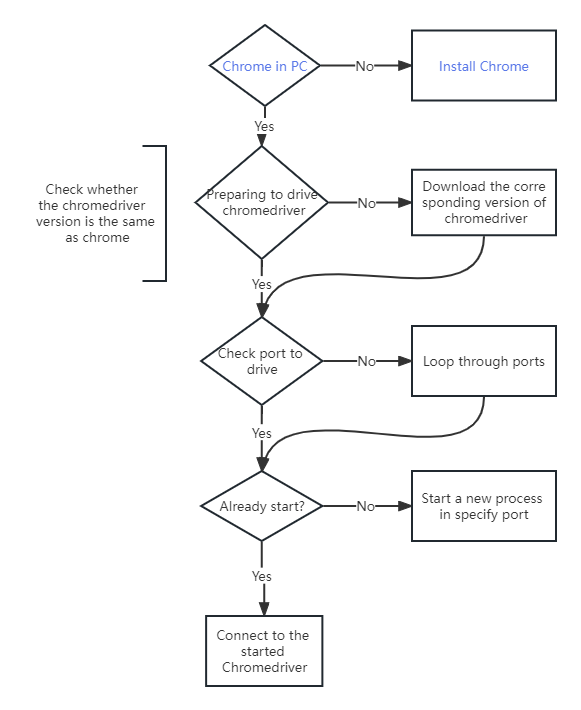

<h1 align="center">
  
   Getusee
</h1>

<h4 align="center">基于selenium + Chrome的快速网络爬虫开发工具</h4>

  
  

## 介绍

本项目是为了快速开发一些自动化网页测试以及自动化网页数据等小工具
基于selenium包的获取（虽然数据获取效率不如直接request包）。但"life is short, use python"
，它可以节省你匹配chrome驱动等软件的时间，以便于开发人员将时间花在获取数据上。

## 构建流程

*蓝色字体的过程仍需要手动执行

  

## 样板代码

TODO

### 相关仓库

- [selenium](https://selenium-python-zh.readthedocs.io/en/latest/installation.html)

### 歌曲🎶

[Undertale --undertale](https://www.youtube.com/watch?v=8CeYNJ-s0Kw)
